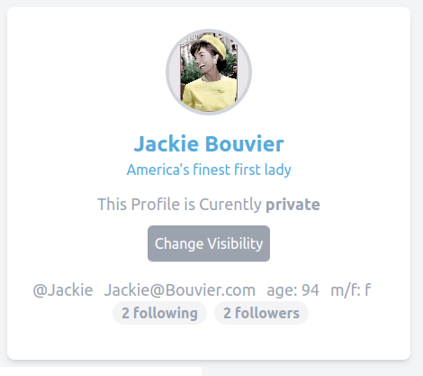
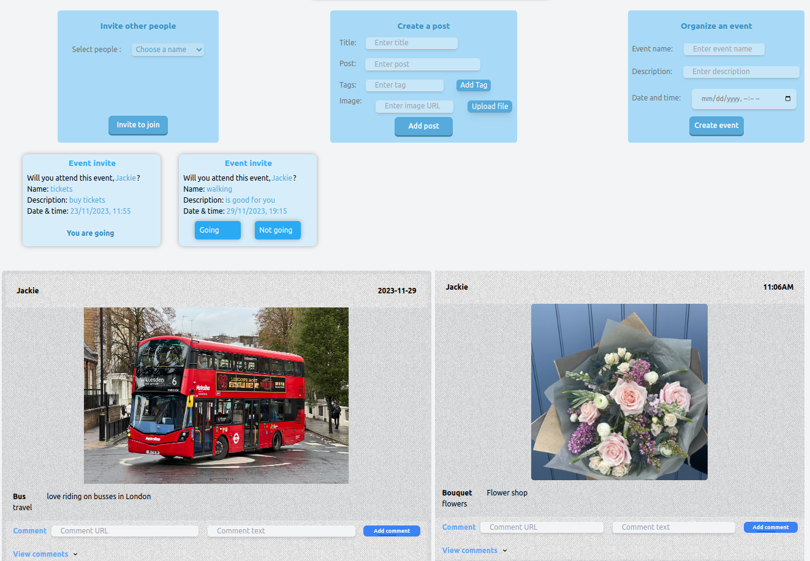

Facebook-like social network that features
Followers, Profile, Posts, Groups, Notifications, Chats






### How To Run 'social-network'

# Run 'social-network' in Docker:
1. To check docker status type: 
```bash
systemctl status docker
```
2. In VSC terminal access 'social-network' root folder and type: 
```bash
~$ systemctl start docker 
~$ sudo docker-compose up
```

3. When images have been built and the containers are running, go to browser url address and type: 
```bash
http//localhost:3000
```

# To exit Docker 
1. In VSC terminal type: 
```bash 
~$ CTRL + C 
~$ sudo docker-compose down
```

2. To remove images type: 
```bash
sudo docker image rm -f $(sudo docker image ls)
```

3. To view all containers: 
```bash
sudo docker ps -a
```

4. To remove a container type: 
```bash
sudo docker rm container ID e.g. 637a717eb106
```
   
5. To stop docker type: 
```bash
systemctl stop docker
```


# Troubleshooting:
1) If get error message: docker-compose-error-internal-booting-buildkit-http-invalid-host-header
Run command to add user to the docker group: 
```bash
sudo usermod -aG docker $USER
```

2) If get Go error message: 
update the backend dockerfile to pull an updated go image from repository at https://hub.docker.com/_/golang


# Run 'social-network' locally
1. In the 'frontend' folder make an '.env' file that contains: 
REACT_APP_API_URL=http://localhost:8000
DANGEROUSLY_DISABLE_HOST_CHECK=true

2. To install node files and create the package-lock.json and package.json files:
```bash
~$ cd frontend
~$ npm install react scripts
```


3. Check that this line of code is contained within the sqlite.go OpenDatabase function:
```bash
sqliteDatabase, err := sql.Open("sqlite3", filename+"?_journal_mode=WAL")
```


3. To run the GO back-end server:
```bash
~$ cd backend
~$ go run server.go
```


4. To run the React front-end server, in a separate VSC terminal window type:
```bash
~$ cd frontend
~$ npm start
```


